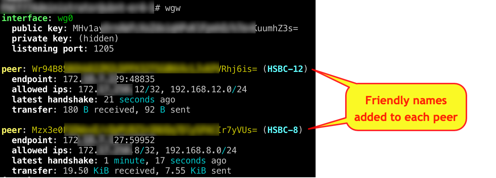

# wgw
WireGuard Wrapper (Key Management + Friendly Names)

This is a wrapper script for WireGuard VPN that displays friendly names when listing WireGuard connection status, and also handles key management chores (e.g. creating new keys, listing existing keys, etc.)  

This is what WireGuard connection status looks like when it's displayed through this script:



# Overview
- The `.publickey` files of vpn peers are stored under the `clients` folder (see [Repository Structure](README.md#repository-structure) below).
- The filename of `.publickey` files becomes the "friendly name" shown for each peer (e.g. a publickey file named `Dave's Cell.publickey` creates a friendly name of "Dave's Cell" for his publickey).  
- In addition to formatting `WG info` output with "friendly names", **wgw** also provides commands that help manage creating and maintaining private and public keys for vpn peers.
<!-- determines the "friendly name" of peer connections by finding the public key for the peer in a folder that contains the public key files, and then adds the friendly name (the file name of the public key file) into the output of the "WG show" command.     (respository) of public key files maintaining a repository uses the name of the publickey file builds an associative array of "friendly names" to public keys (for VPN peers) by using the name of the file holding the publickey <peer>.publickey files in the clients folder of the base repository.-->
## Repository Structure
```
├── <Repo_Base_Folder>
│   ├── clients
│   │   ├── Dave's Cell.privatekey
│   │   ├── Dave's Cell.publickey
│   │   ├── Dave's Cell.privatekey
│   │   ├── Dave's Cell.publickey
│   ├── server
│   │   ├── server.privatekey
│   │   ├── server.publickey
```

# Installation Steps
- ToDo

# Command Line Options
- ToDo

